# Assignment 2 of Software Architecture course

This is the GitHub repository for the second assignment of the Software Architecture course @ VUB 2020-2021. This assignment was made in the second examination period.

## Table of contents

> - [Student info](#student-info)
> - [Important files and folders](#important-files-and-folders)
> - [Notes on the code](#notes-on-the-code)
> - [Running the code](#running-the-code)
> - [Validated output](#validated-output)

## Student info
- **Name**: Bontinck Lennert
- **Email**: lennert.bontinck@vub.be
- **StudentID**: 568702
- **Affiliation**: VUB - Master Computer Science: AI

## Important files and folders
- [Assignment PDF](assignment.pdf)
- [Report containing explanation on solution of the assignment](Lennert-Bontinck-SA2.pdf)
- [Written code folder](code/)

## Notes on the code

- The code has been developed on macOS Big Sur by using the IntelliJ IDEA 2021.1.3 Ultimate Edition and the "Scala" plugin by JetBrains.

- - It was validated to work on a Windows 10 machine as well using the same software.

- For this project, the following version of base software are used (same as WPOs)

- - JRE and JDK 1.8.291
  - sbt 1.3.13

- The sbt build will provide the Scala Play dependencies.

## Running the code

- Open the build.sbt file available under code\Lennert-Bontinck-SA2\build.sbt with the IntelliJ IDEA.
- Select Open as Project and select Trust Project.
- The IntelliJ IDEA should build the build.sbt file providing the dependencies. If all base software was installed with the same versions as used for this assignment, it should provide the correct SDKs as well.
- By default, the Scala Play compiler is disabled in the IntelliJ IDEA, enable it via the IDEA settings: Languages & Frameworks -> Play2 -> Use Play2 compiler for this project. Press Apply followed by OK
- Rebuilt the project.
- Using the terminal inside the IntelliJ IDEA, execute sbt run.
- Using your internet browser, navigate to [localhost:9000](http://localhost:9000/).

## Default accounts

Some users are loaded in by default, you can see these under users variable in the UserDao class under models. Due to the visibility settings of some of the preloaded posts, SnellenEddy and JohnyBravo will see some posts that Lennert does not.

- Usernames: Lennert | SnellenEddy | JohnyBravo
- Password: AmazingPassword

## Validated output

Below are some screenshots of the application running, showing the required functionality is there.

### Custom titles and favicon in tab

notice that the text before ```| CarLovers``` can be passed to the main template which provides the header + nav and footer.

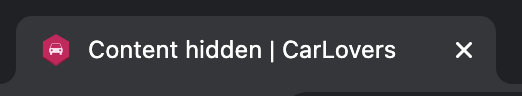

### Pages only visible to logged-in users

The custom classes ```AuthenticatedUserAction```and ```AuthenticatedUserActionWithMessageRequestensure``` provide actions for pages that are only visible to logged-in users, if not logged in the following screen will be shown.

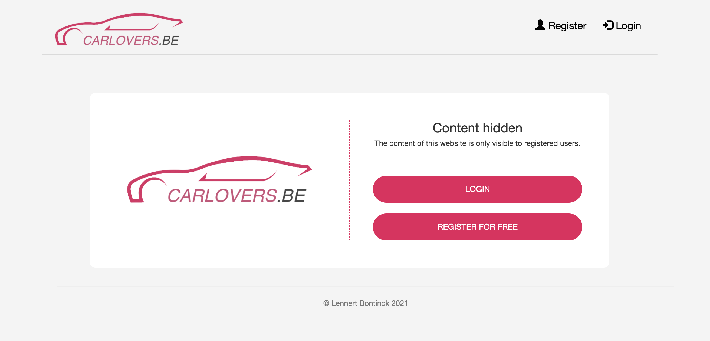

### Register and login capabilities with validation and flash

As per the requirement the user can register and log in. For registration a unique username (ignoring casing) is required, appropriate error handling is provided. Upon successful creation of a user, (s)he can log in and is forwarded to the login screen with a flash provided infobox.

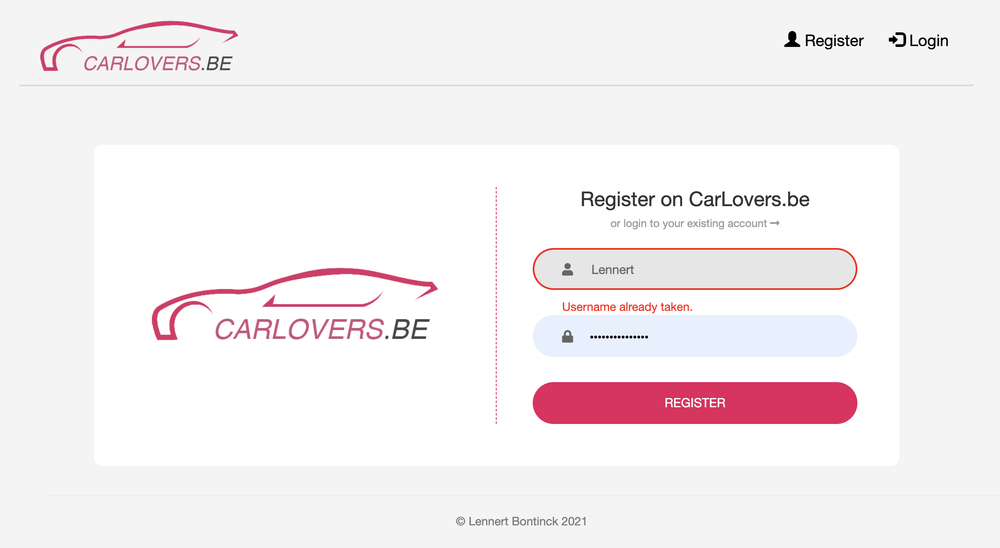

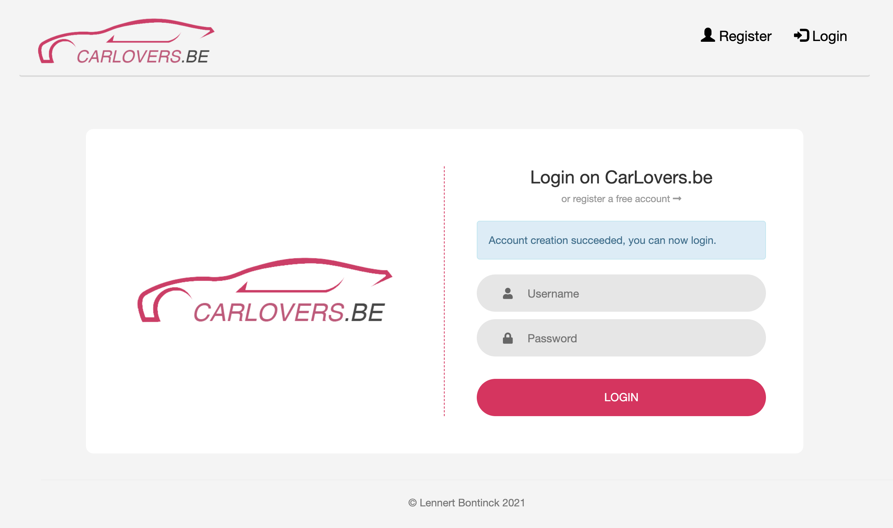

### Home page with sorting capabilities and different menu for logged in users

As per the requirement of the assignment, the logged-in user has a different menu (dropdown icon with required options of adding a post, viewing profile and logging out). On the home page, the user can select to view posts in the most recent or most liked order, both are shown below. Notice that the heart like icon is a button and will be coloured pink if the user has liked the post and has an appropriate message below it. Also, notice the ```Delete``` and ```Change visibility``` are only visible on posts of whom the logged-in user is the author. The CarLovers logo functions as the home button. Also, notice the amount of shown comments is limited to 3 on the home page as well as the length of the description and comment is limited to not cause overflow.

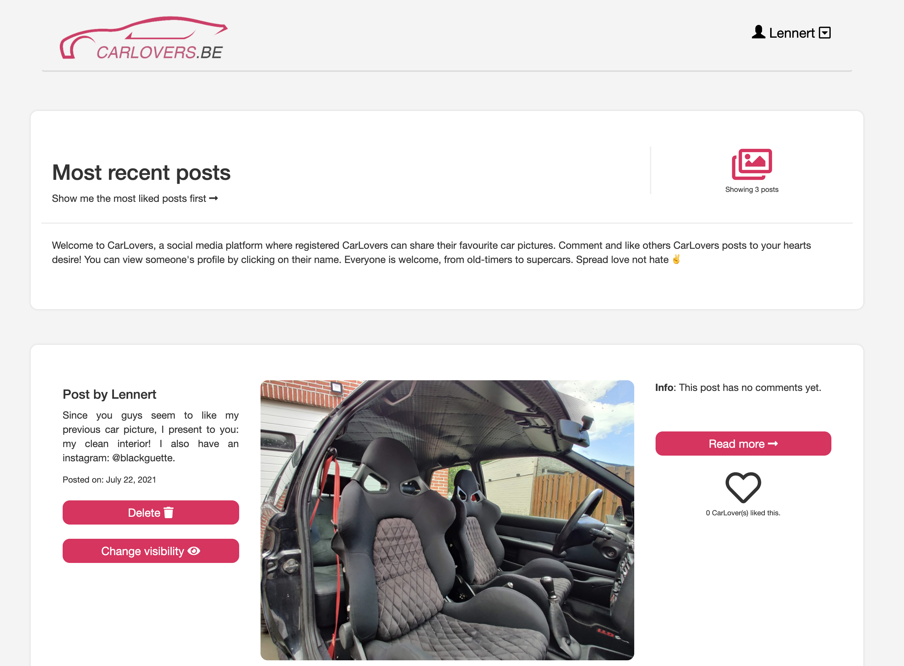

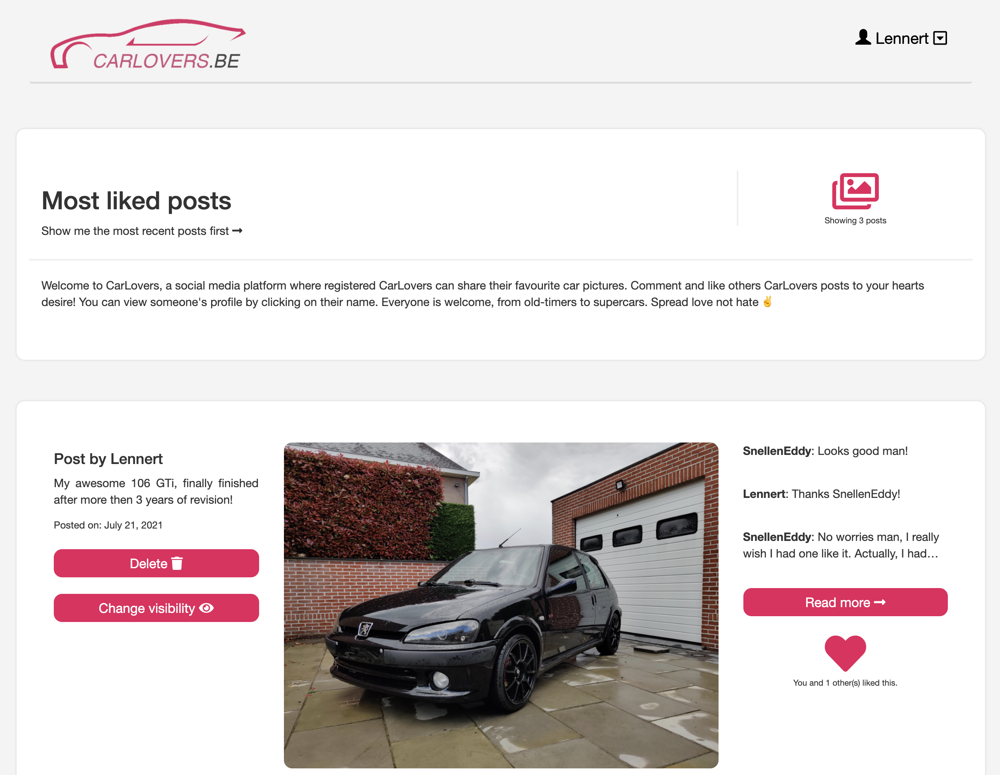

### Different posts are shown for different users

As per the requirement of allowing a user to share his posts with a specific list of users, different users have different home views. Notice below that "SnellenEddy" sees a post that user "Lennert" does not. Also, notice that the ```Delete``` and ```Change visibility``` buttons are not visible for "SnellenEddy" as he is not the author of the post.


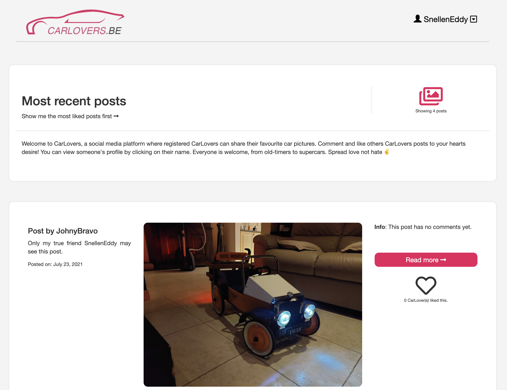

### Post page allows for commenting

The post page, reachable by clicking ```Read more``` or clicking on the post image, allows for a user to place a comment. The same like button as the overview page is also visible. Again notice that only the author of the post will see the delete and edit buttons, which are also reused from the overview page. Also notice that the post page does show the full description and all comments.


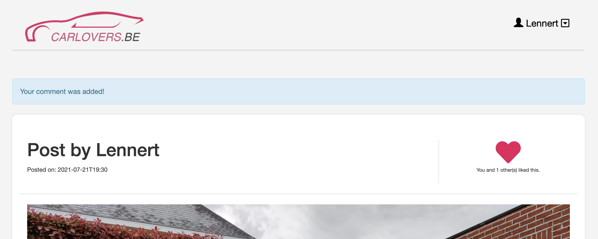

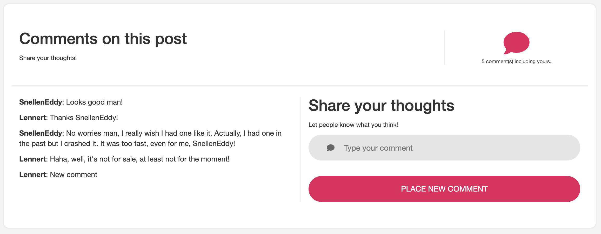

### Viewing profiles

When clicking on a username (anywhere you find one; comments or post author) or visiting your account from the drop-down menu, the same style of list from the home overview is shown with only the selected user's posts. Visibility is respected and custom messages are shown if the user has no posts etc.

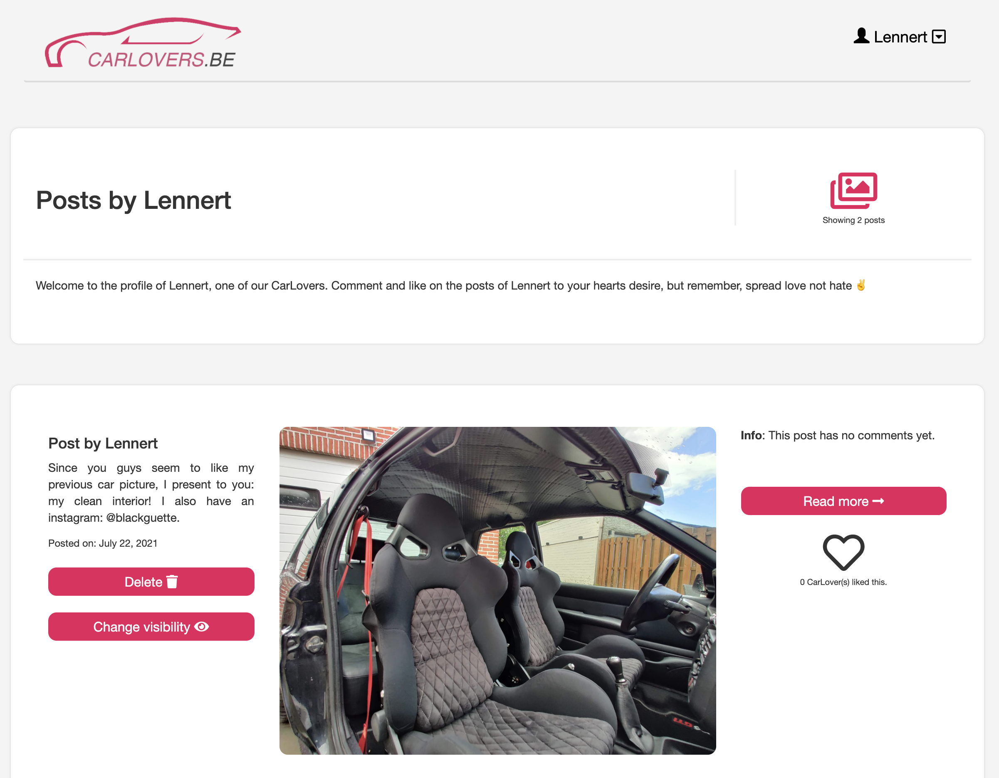

### Add post

When adding a post the user must provide 1 JPG/JPEG image and a non-empty description. He can also decide to share the post with everyone or a select list of users. Notice that the author can always see his posts thus his username is not available in the list of users. After adding the post the user is forwarded to the newly added post and shown a flash message.

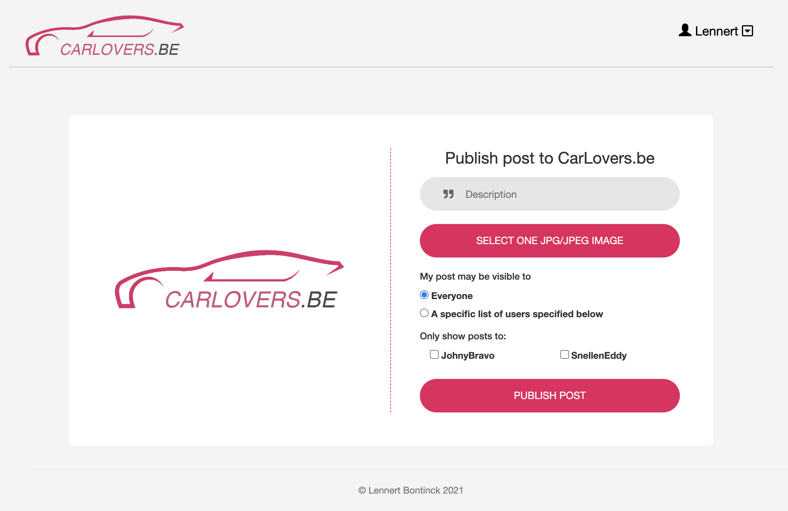

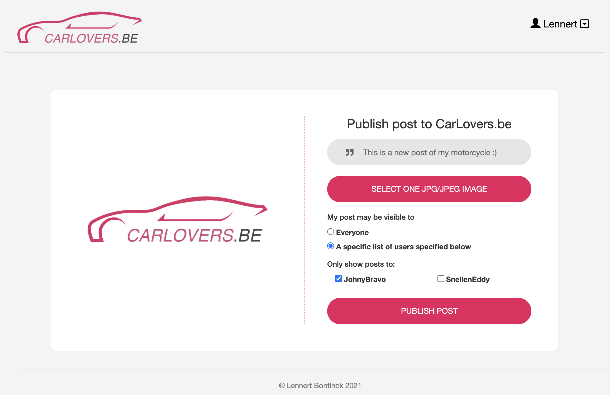

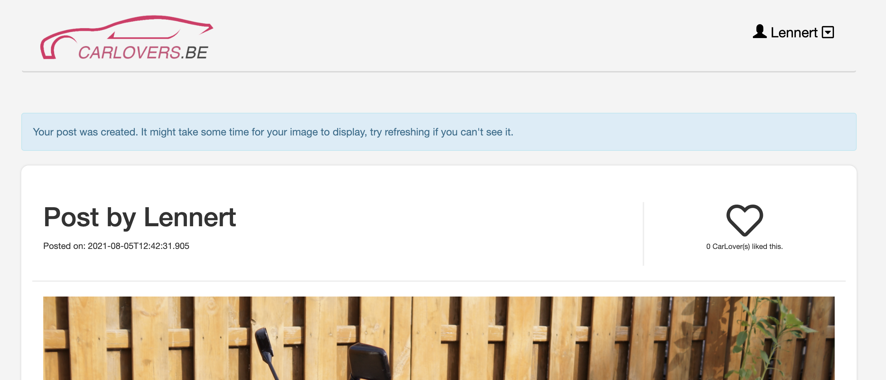

### Edit visibility of a post

As per the requirement of the assignment, one can edit the visibility of a post. When loading this edit page the previous settings are loaded in (compare it with the add post page above!).

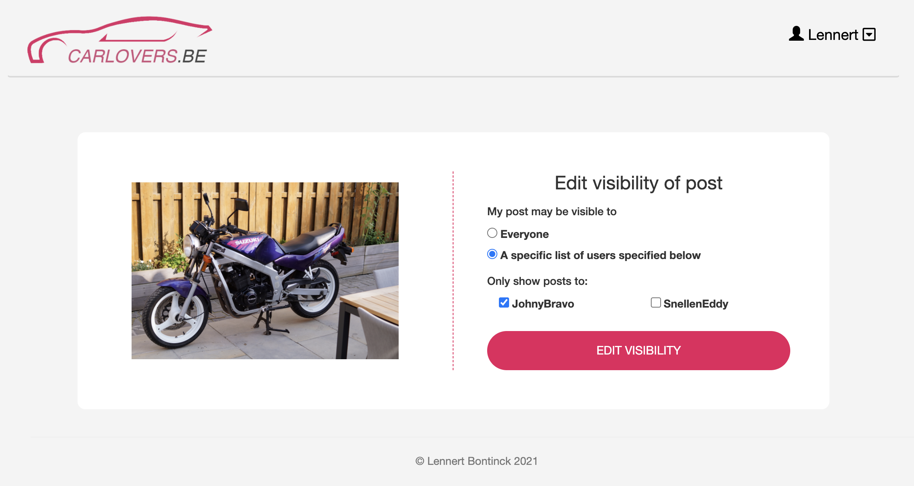

### Delete post

Deleting the post will also delete the likes, comments and visibility object. It is as simple as clicking the ```Delete``` button. The user is forwarded to his profile page and shown an appropriate flash message.

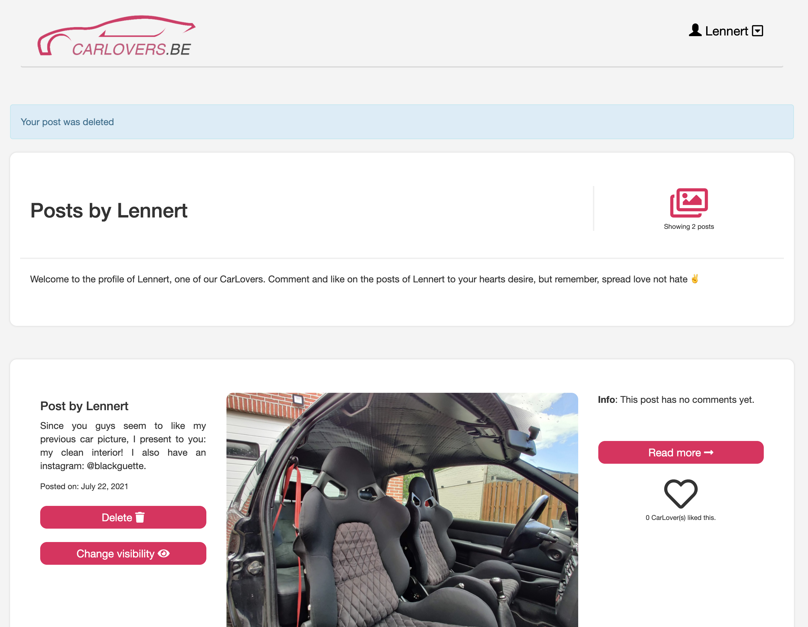
